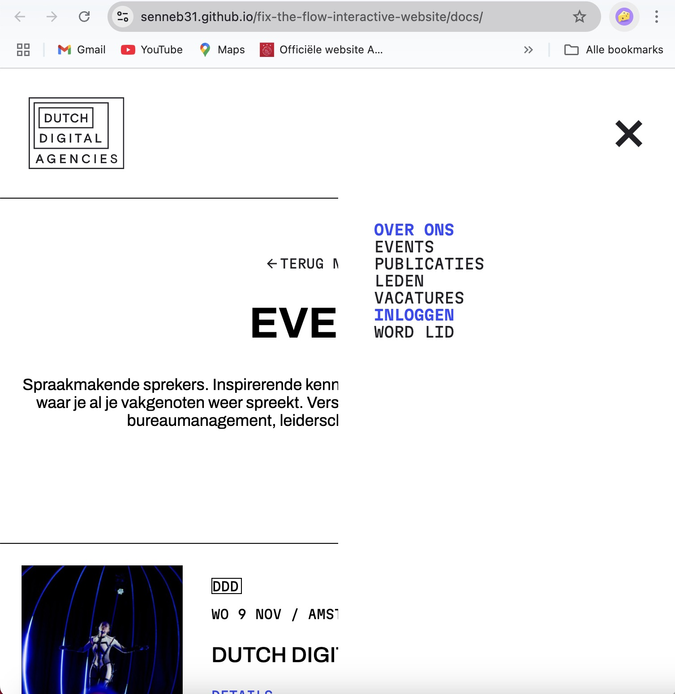

Ontwerp en maak een interactieve website voor een opdrachtgever.

De instructie vind je in: [INSTRUCTIONS.md](https://github.com/fdnd-task/fix-the-flow-interactive-website/blob/main/docs/INSTRUCTIONS.md)

# Titel
DDA: een pagina waar alle events te zien zijn!

## Beschrijving
In deze sprint stonden microinteracties centraal. Ik heb ik mijn website wat microinteracties toegevoegd via CSS en JS. Wat ik in deze website heb geïmplementeerd zijn animaties aan tabs en het hamburger menuutje dat overspringt in een kruisje. Hieronder laat ik zien wat ik daarmee bedoel.
<<<<<<< HEAD

=======

## Kenmerken
Door de tabs toe te laten verschuiven heb ik keyframes gebruikt. Ik heb transform: translateX gebruikt om de tabs te verschuiven. Ik wilde dat de tabs gingen verschuiven als je er overheen ging met je muis. Hiervoor heb ik in CSS :hover toegevoegd aan de class.

## Bronnen

## Licentie

This project is licensed under the terms of the [MIT license](./LICENSE).

