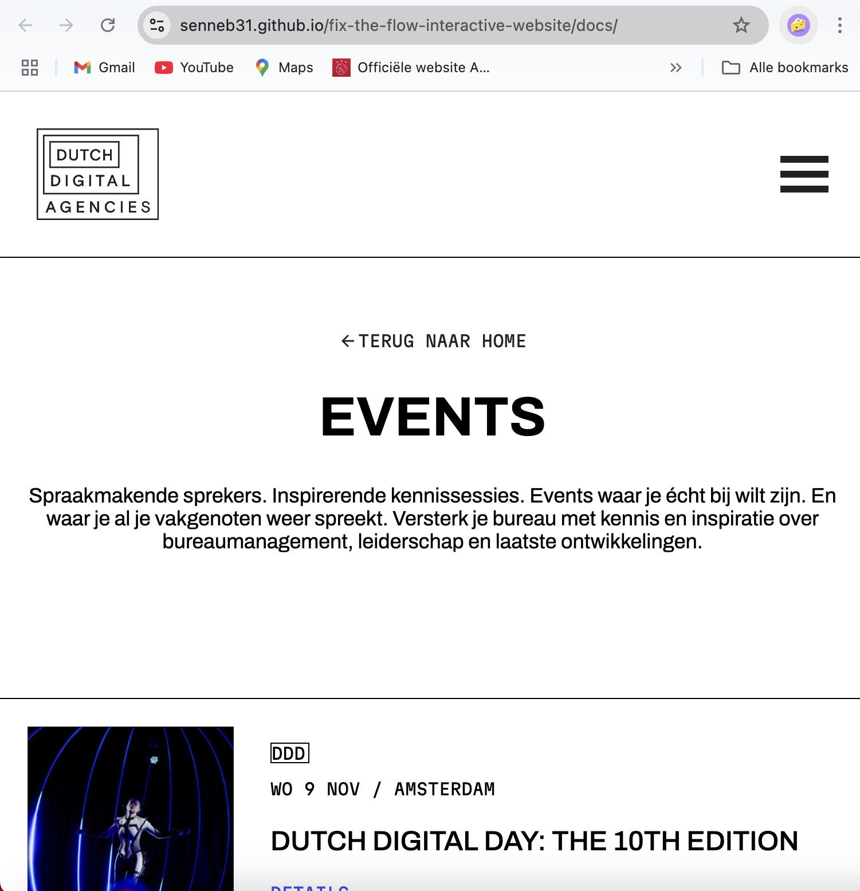

Ontwerp en maak een interactieve website voor een opdrachtgever.

De instructie vind je in: [INSTRUCTIONS.md](https://github.com/fdnd-task/fix-the-flow-interactive-website/blob/main/docs/INSTRUCTIONS.md)

# Titel
DDA: een pagina waar alle events te zien zijn!

## Beschrijving
In deze sprint stonden microinteracties centraal. Ik heb ik mijn website wat microinteracties toegevoegd via CSS en JS. Wat ik in deze website heb geïmplementeerd zijn animaties aan tabs en het hamburger menuutje dat overspringt in een kruisje. Hieronder laat ik zien wat ik daarmee bedoel.

=======

## Kenmerken
D.m.v de animatie in het burger menuutje laat ik zien dat het voor de gebruiker duidelijk is dat hij in een menu zit en hoe hij die kan sluiten. Om het menuutje te maken gebruik ik span tags en style ik die in de CSS. Om het kruisje te maken roteer ik de spans 45 graden.

## Bronnen

## Licentie

This project is licensed under the terms of the [MIT license](./LICENSE).

